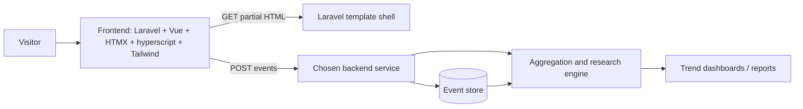
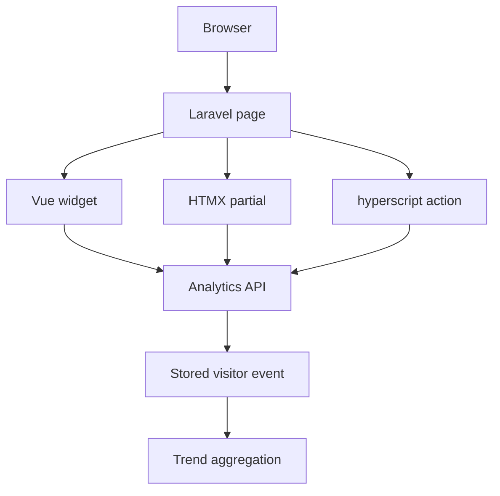
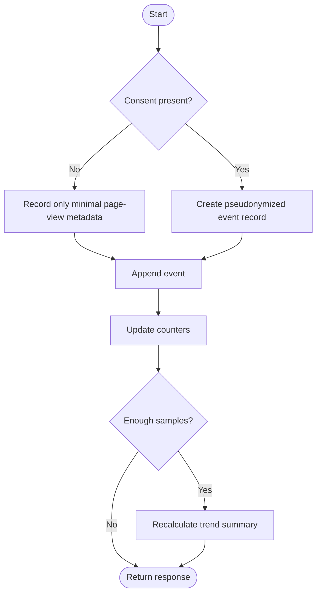
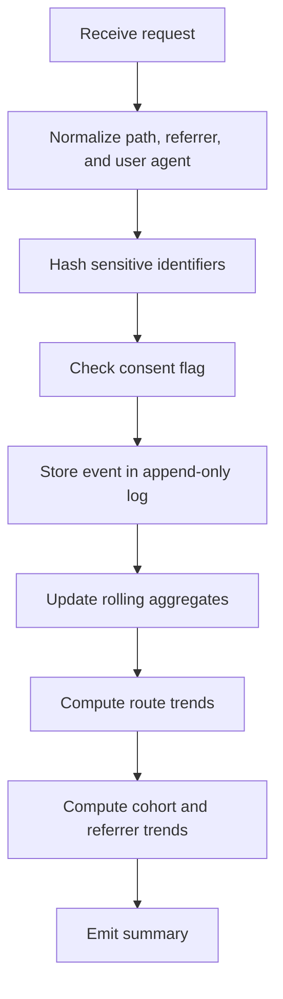

# LaraVue

**LaraVue** is a template repository for building application repositories from a shared starting point.

It is organized around:

- a frontend sample that combines **Laravel + Vue.js + HTMX + hyperscript + Tailwind CSS**
- backend samples that show the same visitor-event analytics model in multiple languages
- deployment notes for **Render** and **Vercel**
- Mermaid diagrams for the architecture, request flow, and analytics algorithm

This repository is intentionally a **template**. It is meant to be copied, customized, and split into project-specific repositories.

## What this template demonstrates

The frontend sample shows how the template repository should explain itself to users and how a product shell can be composed from:

- Laravel for the server-rendered application layer
- Vue.js for interactive widgets
- HTMX for partial swaps
- hyperscript for lightweight behavior
- Tailwind CSS for utility-first styling

The backend samples show a visitor analytics model that records:

- timestamp
- route
- referrer
- user agent
- session identifier
- pseudonymized IP hash
- consent state
- dwell time
- scroll depth
- conversion events
- simple anomaly score

The examples are written as **reference implementations**. They are designed to be understandable first, then adapted into a production repository for the relevant stack.

## Recommended repository layout

```text
LaraVue/
├─ README.md
├─ .env.example
├─ .gitignore
├─ frontend/
│  └─ laravel-vue-hx/
│     ├─ README.md
│     ├─ package.json
│     ├─ vite.config.js
│     ├─ postcss.config.js
│     ├─ tailwind.config.js
│     └─ resources/
│        ├─ css/app.css
│        ├─ js/app.js
│        ├─ js/components/VisitorTemplateDemo.vue
│        └─ views/app.blade.php
└─ backend/
   ├─ shared/visitor-event-schema.md
   ├─ python-fastapi/main.py
   ├─ csharp-aspnet/Program.cs
   ├─ rust-actix-web/main.rs
   ├─ cpp/main.cpp
   ├─ java-processing/AnalyticsSketch.pde
   ├─ zig/main.zig
   ├─ mojo/main.mojo
   ├─ fstar/VisitorAnalytics.fst
   └─ dafny/VisitorAnalytics.dfy
```

## How to use this repository as a template

### 1) Create the Laravel application

The Laravel side of the template is designed to be generated from the standard Laravel installer workflow:

```bash
composer create-project laravel/laravel sample
```

After the project is created, copy the sample files from `frontend/laravel-vue-hx/` into the generated Laravel project as needed.

### 2) Create the Vue application

The Vue starter path is based on the standard Vue scaffolding command:

```bash
npm create vue@latest
```

Use the generated Vue project as the interactive frontend module, or mount it inside the Laravel shell when you want a hybrid SSR + SPA experience.

### 3) Add HTMX, hyperscript, and Tailwind CSS

This template assumes that:

- HTMX handles partial HTML replacement
- hyperscript handles small interaction rules
- Tailwind CSS handles layout and styling
- Vue handles richer client-side widgets

That combination keeps the application easy to reason about while still allowing progressively enhanced interactions.

## Local development outline

The template does not force a single final runtime. Instead, it supports several project shapes:

- Laravel-only frontend shell
- Laravel + Vue hybrid application
- Python / C# / Rust / other backend service repositories split from the same template
- separate frontend and backend repositories that share the same event contract

A practical local workflow is:

1. generate the Laravel application
2. generate the Vue application
3. copy the sample components into the generated projects
4. choose one backend sample as the live analytics service
5. wire the frontend to that service with environment variables

## Deployment overview

### Render

Render supports deployment from a Git provider, a public Git repository, or a Docker image, and web services must bind to `0.0.0.0` on the expected port so they can receive public HTTP traffic. The platform also provides a Laravel template and a Vue template, which makes it a natural fit for this repository structure.

A simple deployment path is:

1. push the repository to GitHub
2. create a new Render Web Service from that repository
3. set the build command for the selected stack
4. set the start command
5. add environment variables such as `APP_KEY`, database connection values, and analytics settings
6. deploy

For a Laravel service, Render’s official Laravel guide uses a Docker-based setup with PostgreSQL support.

### Vercel

Vercel connects to Git repositories and creates automatic preview deployments, and it also updates custom domains automatically. That makes it a good fit for the frontend-only side of this template, especially when the Vue or static presentation layer is deployed separately from the analytics services.

A simple Vercel path is:

1. push the frontend repository or frontend subproject to GitHub
2. connect the repository in Vercel
3. let Vercel detect the framework
4. configure the build output if needed
5. deploy and use preview URLs for review
6. attach a custom domain when ready

## Mermaid architecture



## Mermaid arrow diagram



## Mermaid flowchart



## Mermaid algorithm



## Privacy and compliance note

The backend samples are intentionally written around **pseudonymized analytics** rather than covert tracking. Use consent controls, retention limits, and jurisdiction-appropriate policies before collecting production traffic data.

## License

Choose a license that matches your repository policy before publishing this template.
