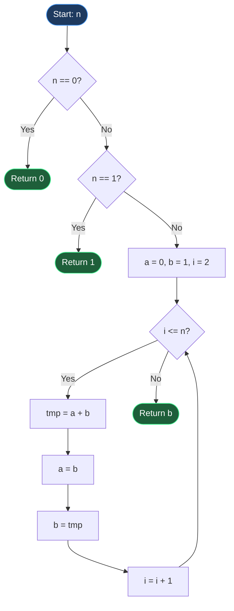
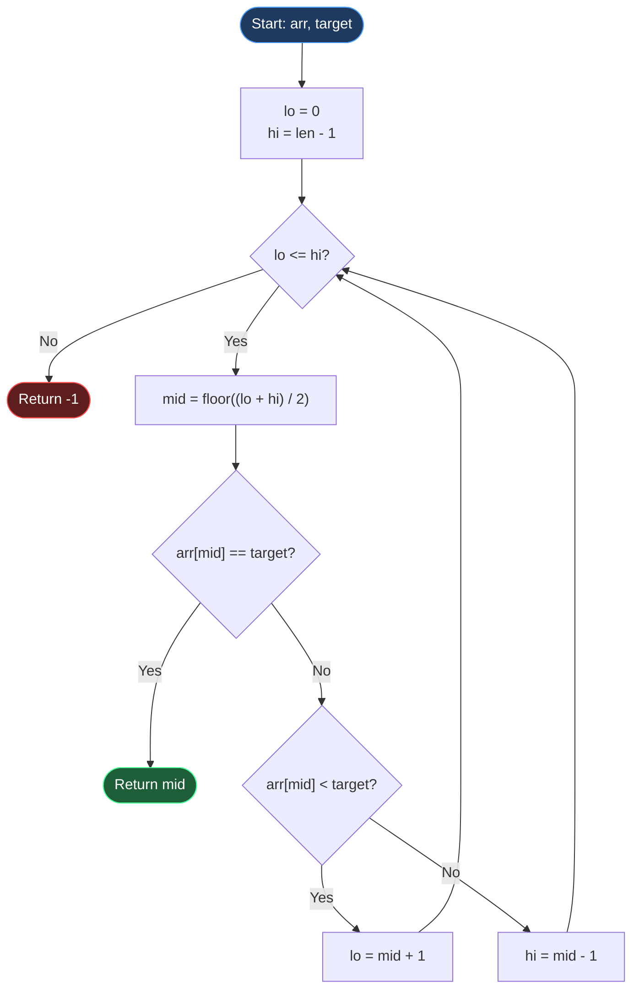
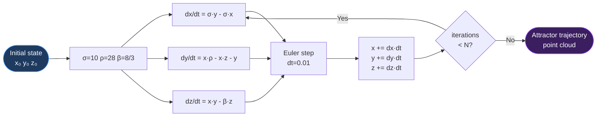
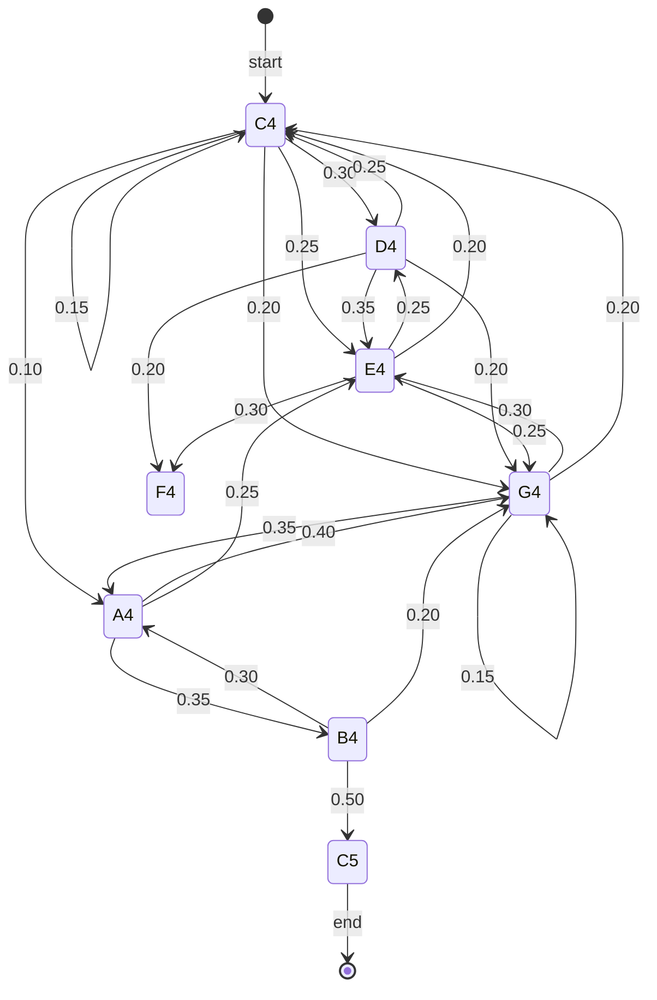
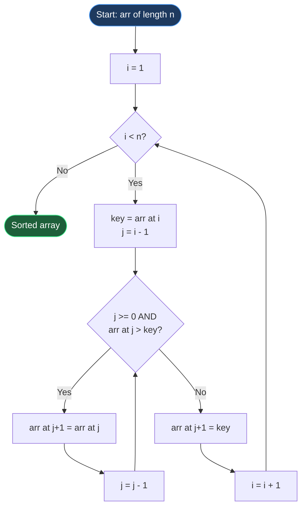

# Algorithm Diagrams

## Fibonacci (Iterative)

```mermaid
flowchart TD
    A([Start: n]) --> B{n == 0?}
    B -- Yes --> R0([Return 0])
    B -- No --> C{n == 1?}
    C -- Yes --> R1([Return 1])
    C -- No --> D[a = 0, b = 1, i = 2]
    D --> LOOP{i <= n?}
    LOOP -- Yes --> E[tmp = a + b]
    E --> F[a = b]
    F --> G[b = tmp]
    G --> H[i = i + 1]
    H --> LOOP
    LOOP -- No --> RN([Return b])

    style A fill:#1e3a5f,stroke:#4a9eff,color:#fff
    style R0 fill:#1e5f3a,stroke:#4aff9a,color:#fff
    style R1 fill:#1e5f3a,stroke:#4aff9a,color:#fff
    style RN fill:#1e5f3a,stroke:#4aff9a,color:#fff
```

## Binary Search

```mermaid
flowchart TD
    A([Start: arr, target]) --> B["lo = 0<br/>hi = len - 1"]
    B --> LOOP{lo <= hi?}
    LOOP -- No --> NOTFOUND([Return -1])
    LOOP -- Yes --> C["mid = floor((lo + hi) / 2)"]
    C --> D{"arr[mid] == target?"}
    D -- Yes --> FOUND([Return mid])
    D -- No --> E{"arr[mid] < target?"}
    E -- Yes --> F["lo = mid + 1"]
    E -- No --> G["hi = mid - 1"]
    F --> LOOP
    G --> LOOP

    style A fill:#1e3a5f,stroke:#4a9eff,color:#fff
    style FOUND fill:#1e5f3a,stroke:#4aff9a,color:#fff
    style NOTFOUND fill:#5f1e1e,stroke:#ff4a4a,color:#fff
```

## Lorenz Attractor (used in Synesthetic Studio)

```mermaid
flowchart LR
    A([Initial state\nx₀ y₀ z₀]) --> B[σ=10 ρ=28 β=8/3]
    B --> C[dx/dt = σ·y - σ·x]
    B --> D[dy/dt = x·ρ - x·z - y]
    B --> E[dz/dt = x·y - β·z]
    C --> F[Euler step\ndt=0.01]
    D --> F
    E --> F
    F --> G[x += dx·dt\ny += dy·dt\nz += dz·dt]
    G --> H{iterations\n< N?}
    H -- Yes --> C
    H -- No --> I([Attractor trajectory\npoint cloud])

    style A fill:#1e3a5f,stroke:#4a9eff,color:#fff
    style I fill:#3a1e5f,stroke:#9a4aff,color:#fff
```

## Markov Chain Melody Generation

```mermaid
stateDiagram-v2
    [*] --> C4 : start
    C4 --> D4 : 0.30
    C4 --> E4 : 0.25
    C4 --> G4 : 0.20
    C4 --> C4 : 0.15
    C4 --> A4 : 0.10

    D4 --> E4 : 0.35
    D4 --> C4 : 0.25
    D4 --> G4 : 0.20
    D4 --> F4 : 0.20

    E4 --> F4 : 0.30
    E4 --> D4 : 0.25
    E4 --> G4 : 0.25
    E4 --> C4 : 0.20

    G4 --> A4 : 0.35
    G4 --> E4 : 0.30
    G4 --> C4 : 0.20
    G4 --> G4 : 0.15

    A4 --> G4 : 0.40
    A4 --> B4 : 0.35
    A4 --> E4 : 0.25

    B4 --> C5 : 0.50
    B4 --> A4 : 0.30
    B4 --> G4 : 0.20

    C5 --> [*] : end
```

## Insertion Sort

```mermaid
flowchart TD
    A([Start: arr of length n]) --> B[i = 1]
    B --> OUTER{i < n?}
    OUTER -- No --> DONE([Sorted array])
    OUTER -- Yes --> C[key = arr at i\nj = i - 1]
    C --> INNER{j >= 0 AND\narr at j > key?}
    INNER -- Yes --> D[arr at j+1 = arr at j]
    D --> E[j = j - 1]
    E --> INNER
    INNER -- No --> F[arr at j+1 = key]
    F --> G[i = i + 1]
    G --> OUTER

    style A fill:#1e3a5f,stroke:#4a9eff,color:#fff
    style DONE fill:#1e5f3a,stroke:#4aff9a,color:#fff
```
