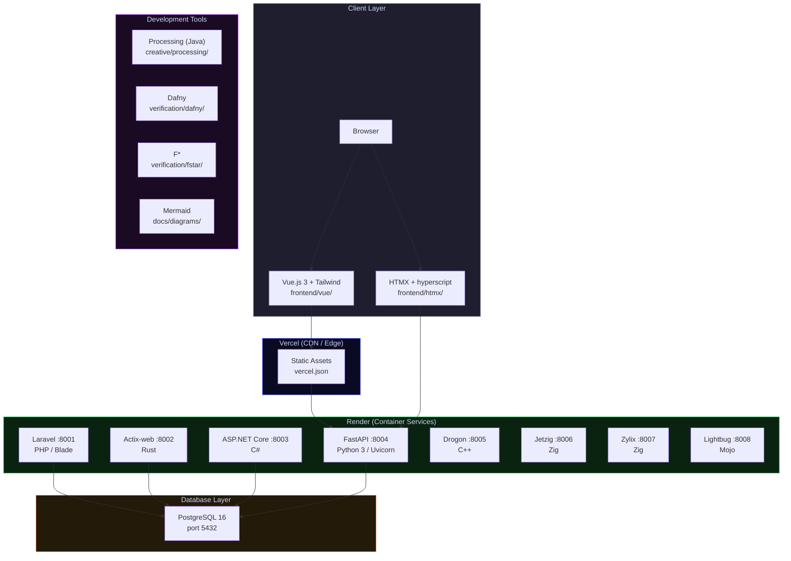

# Architecture Diagram

```mermaid
graph TB
    subgraph CLIENT["Client Layer"]
        BR["Browser"]
        HTMX["HTMX + hyperscript\nfrontend/htmx/"]
        VUE["Vue.js 3 + Tailwind\nfrontend/vue/"]
    end

    subgraph VERCEL["Vercel (CDN / Edge)"]
        V_STATIC["Static Assets\nvercel.json"]
    end

    subgraph RENDER["Render (Container Services)"]
        R_LARAVEL["Laravel :8001\nPHP / Blade"]
        R_ACTIX["Actix-web :8002\nRust"]
        R_ASPNET["ASP.NET Core :8003\nC#"]
        R_FASTAPI["FastAPI :8004\nPython 3 / Uvicorn"]
        R_DROGON["Drogon :8005\nC++"]
        R_JETZIG["Jetzig :8006\nZig"]
        R_ZYLIX["Zylix :8007\nZig"]
        R_LIGHTBUG["Lightbug :8008\nMojo"]
    end

    subgraph DB["Database Layer"]
        PG["PostgreSQL 16\nport 5432"]
    end

    subgraph TOOLS["Development Tools"]
        PROCESSING["Processing (Java)\ncreative/processing/"]
        DAFNY["Dafny\nverification/dafny/"]
        FSTAR["F*\nverification/fstar/"]
        MERMAID["Mermaid\ndocs/diagrams/"]
    end

    BR --> HTMX
    BR --> VUE
    VUE --> V_STATIC
    V_STATIC --> R_FASTAPI
    HTMX --> R_FASTAPI

    R_LARAVEL --> PG
    R_ACTIX --> PG
    R_ASPNET --> PG
    R_FASTAPI --> PG

    style CLIENT fill:#1e1e2e,stroke:#6c7086,color:#cdd6f4
    style VERCEL fill:#0a0a23,stroke:#4040ff,color:#cdd6f4
    style RENDER fill:#0a2311,stroke:#40ff80,color:#cdd6f4
    style DB fill:#231a0a,stroke:#ff8040,color:#cdd6f4
    style TOOLS fill:#1a0a23,stroke:#bf40ff,color:#cdd6f4
```
