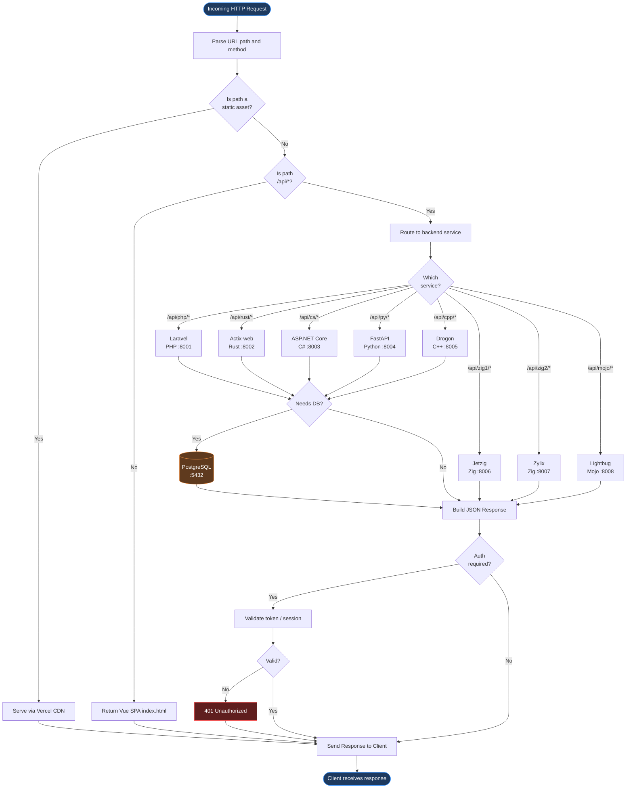

# Request Routing Flowchart

```mermaid
flowchart TD
    START([Incoming HTTP Request]) --> PARSE[Parse URL path and method]

    PARSE --> IS_STATIC{Is path a\nstatic asset?}
    IS_STATIC -- Yes --> VERCEL[Serve via Vercel CDN]
    IS_STATIC -- No --> IS_API{Is path\n/api/*?}

    IS_API -- No --> VUE_SPA[Return Vue SPA index.html]

    IS_API -- Yes --> ROUTE[Route to backend service]

    ROUTE --> WHICH{Which\nservice?}

    WHICH -- /api/php/* --> LARAVEL[Laravel\nPHP :8001]
    WHICH -- /api/rust/* --> ACTIX[Actix-web\nRust :8002]
    WHICH -- /api/cs/* --> ASPNET[ASP.NET Core\nC# :8003]
    WHICH -- /api/py/* --> FASTAPI[FastAPI\nPython :8004]
    WHICH -- /api/cpp/* --> DROGON[Drogon\nC++ :8005]
    WHICH -- /api/zig1/* --> JETZIG[Jetzig\nZig :8006]
    WHICH -- /api/zig2/* --> ZYLIX[Zylix\nZig :8007]
    WHICH -- /api/mojo/* --> LIGHTBUG[Lightbug\nMojo :8008]

    LARAVEL --> DB_CHECK{Needs DB?}
    ACTIX --> DB_CHECK
    ASPNET --> DB_CHECK
    FASTAPI --> DB_CHECK
    DROGON --> DB_CHECK
    JETZIG --> RESPOND
    ZYLIX --> RESPOND
    LIGHTBUG --> RESPOND

    DB_CHECK -- Yes --> PG[(PostgreSQL\n:5432)]
    DB_CHECK -- No --> RESPOND

    PG --> RESPOND[Build JSON Response]
    RESPOND --> AUTH{Auth\nrequired?}

    AUTH -- Yes --> VALIDATE[Validate token / session]
    VALIDATE --> VALID{Valid?}
    VALID -- No --> ERR401[401 Unauthorized]
    VALID -- Yes --> SEND[Send Response to Client]
    AUTH -- No --> SEND

    VERCEL --> SEND
    VUE_SPA --> SEND
    ERR401 --> SEND
    SEND --> END([Client receives response])

    style START fill:#1e3a5f,stroke:#4a9eff,color:#fff
    style END fill:#1e3a5f,stroke:#4a9eff,color:#fff
    style PG fill:#5f3a1e,stroke:#ff9a4a,color:#fff
    style ERR401 fill:#5f1e1e,stroke:#ff4a4a,color:#fff
```
