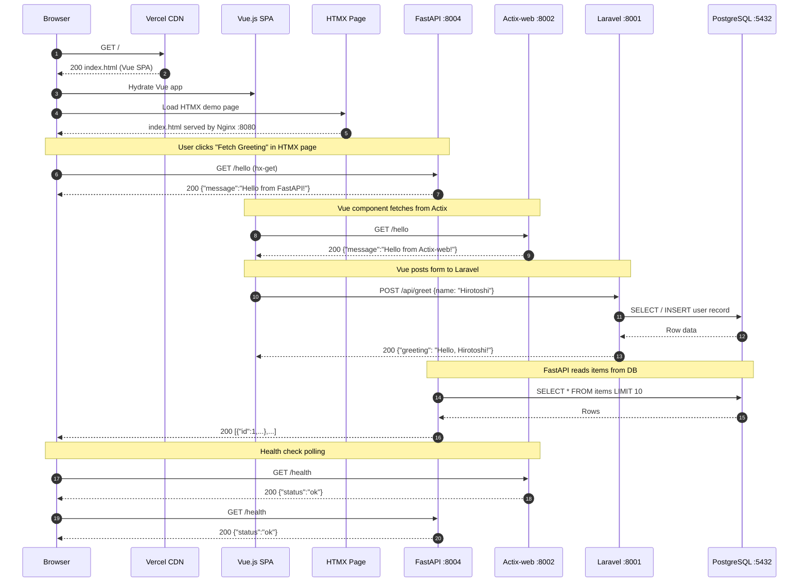
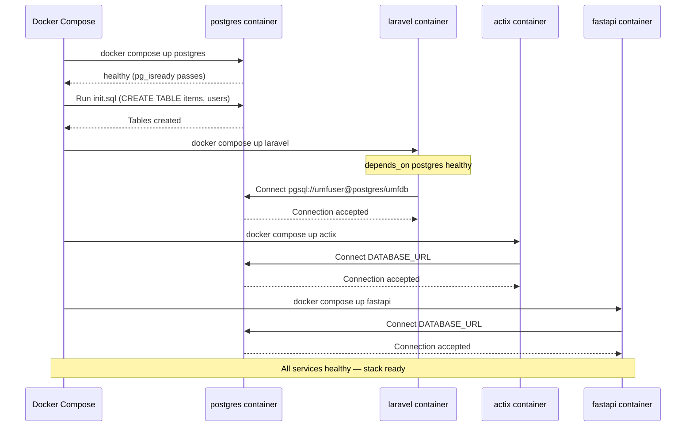

# Service Communication Sequence Diagram

```mermaid
sequenceDiagram
    autonumber
    participant Browser
    participant Vercel as Vercel CDN
    participant Vue as Vue.js SPA
    participant HTMX as HTMX Page
    participant FastAPI as FastAPI :8004
    participant Actix as Actix-web :8002
    participant Laravel as Laravel :8001
    participant PG as PostgreSQL :5432

    Browser->>Vercel: GET /
    Vercel-->>Browser: 200 index.html (Vue SPA)
    Browser->>Vue: Hydrate Vue app

    Browser->>HTMX: Load HTMX demo page
    HTMX-->>Browser: index.html served by Nginx :8080

    Note over Browser,FastAPI: User clicks "Fetch Greeting" in HTMX page
    Browser->>FastAPI: GET /hello (hx-get)
    FastAPI-->>Browser: 200 {"message":"Hello from FastAPI!"}

    Note over Vue,Actix: Vue component fetches from Actix
    Vue->>Actix: GET /hello
    Actix-->>Vue: 200 {"message":"Hello from Actix-web!"}

    Note over Vue,Laravel: Vue posts form to Laravel
    Vue->>Laravel: POST /api/greet {name: "Hirotoshi"}
    Laravel->>PG: SELECT / INSERT user record
    PG-->>Laravel: Row data
    Laravel-->>Vue: 200 {"greeting": "Hello, Hirotoshi!"}

    Note over FastAPI,PG: FastAPI reads items from DB
    FastAPI->>PG: SELECT * FROM items LIMIT 10
    PG-->>FastAPI: Rows
    FastAPI-->>Browser: 200 [{"id":1,...},...]

    Note over Browser,Actix: Health check polling
    Browser->>Actix: GET /health
    Actix-->>Browser: 200 {"status":"ok"}
    Browser->>FastAPI: GET /health
    FastAPI-->>Browser: 200 {"status":"ok"}
```

## Docker Compose Inter-Service Sequence

```mermaid
sequenceDiagram
    participant DC as Docker Compose
    participant PG as postgres container
    participant Laravel as laravel container
    participant Actix as actix container
    participant FastAPI as fastapi container

    DC->>PG: docker compose up postgres
    PG-->>DC: healthy (pg_isready passes)
    DC->>PG: Run init.sql (CREATE TABLE items, users)
    PG-->>DC: Tables created

    DC->>Laravel: docker compose up laravel
    Note over Laravel: depends_on postgres healthy
    Laravel->>PG: Connect pgsql://umfuser@postgres/umfdb
    PG-->>Laravel: Connection accepted

    DC->>Actix: docker compose up actix
    Actix->>PG: Connect DATABASE_URL
    PG-->>Actix: Connection accepted

    DC->>FastAPI: docker compose up fastapi
    FastAPI->>PG: Connect DATABASE_URL
    PG-->>FastAPI: Connection accepted

    Note over DC,FastAPI: All services healthy — stack ready
```
